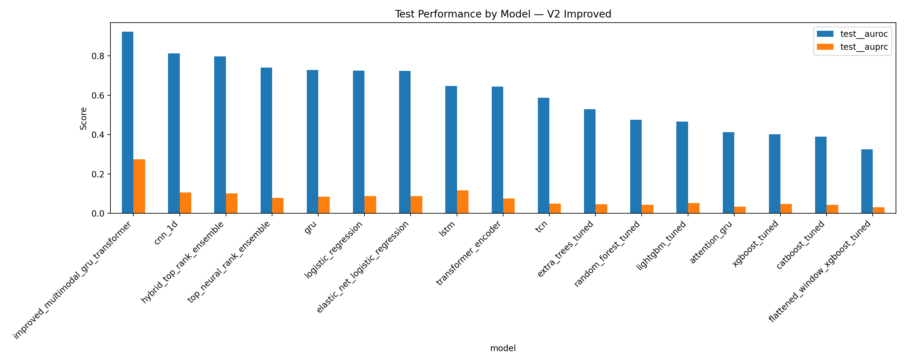
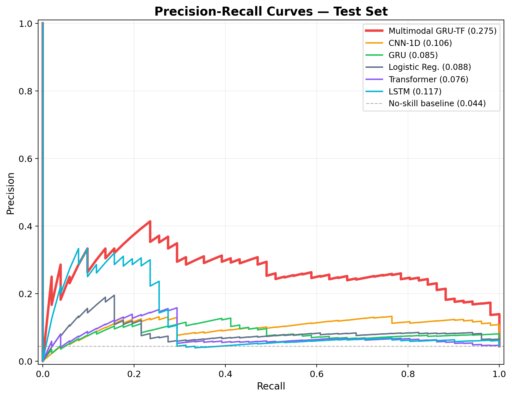
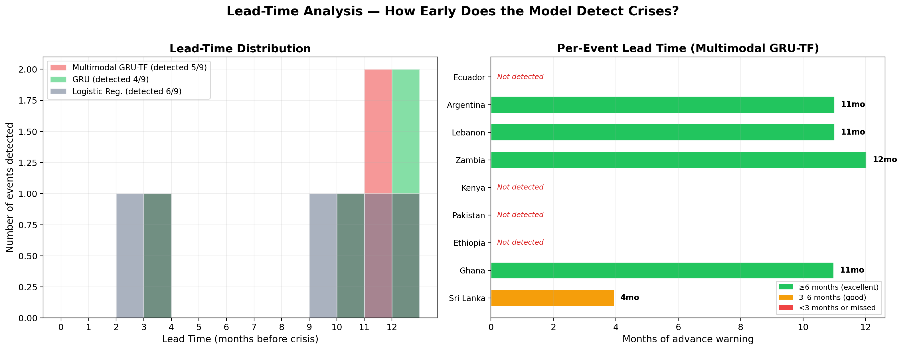

# Early Warning of Sovereign Debt Distress

Predicting sovereign debt distress within 12 months for 32 emerging-market economies using sequence models (GRU, Transformer, LSTM, BiLSTM) and tree-boosting baselines trained on macroeconomic, debt, balance-of-payments, commodity, and political-instability signals.

## Problem

Sovereign debt crises rarely emerge from a single variable. Debt rises while reserves shrink while global financing conditions tighten while political instability grows. Most existing early-warning models use a small set of macro indicators and treat each month independently, missing the cross-signal dynamics that build over time.

We frame the task as **binary time-series classification**: given 24 months of economic and political data for a country, predict whether a debt distress event will start within the next 12 months.

- **Panel:** 32 emerging-market economies × 300 months (Jan 2000 – Dec 2024) = 9,600 country-month observations  
- **Features:** 83 across 7 modalities — macro, debt, balance of payments, global conditions, commodity terms of trade, structural/history, political  
- **Label:** `distress_within_12m` — 1 if a distress episode begins within the next 12 months  
- **Class balance:** ~3–6% positive rate across splits

## Repository structure

```
.
├── README.md
├── requirements.txt
├── notebooks/
│   ├── interim/                       # Interim-submission notebooks (early pipeline)
│   │   ├── 01_preprocessing.ipynb
│   │   └── 02_modeling.ipynb
│   ├── 01_data_cleaning.ipynb         # Final pipeline: raw + panel → train/val/test splits
│   └── 02_model_runner.ipynb          # Final pipeline: trains all models, evaluates, saves results
├── src/
│   └── data_cleaning_pipeline.py      # Raw archives → data/interim/ + data/processed/
├── data/
│   ├── raw/
│   │   ├── fred/                      # FRED global macro series (7 CSV files)
│   │   ├── ctot/                      # IMF Commodity Terms of Trade (1 CSV)
│   │   └── imf_dots/                  # IMF Direction of Trade Statistics (1 CSV)
│   ├── interim/                       # Cleaned single-source CSVs
│   ├── processed/
│   │   └── panel_full.csv             # Merged country-month base panel
│   └── final/                         # Train/val/test tables, sliding-window arrays, metadata
├── results/
│   ├── interim/                       # Interim-submission model results
│   └── final/                         # Final model results: summary, predictions, plots
├── dashboard/
│   └── sovereign_debt_dashboard.html  # Interactive results dashboard (open in browser)
├── figures/                           # Key figures referenced in this README
└── docs/
    ├── data_cleaning_methodology.docx
    └── modeling_guide.docx
```

## Data sources

The base panel (`data/processed/panel_full.csv`) was assembled from the following sources:

| Source | Variables | Coverage |
|--------|-----------|----------|
| IMF World Economic Outlook (WEO) | GDP growth, fiscal balance, current account, debt/GDP, inflation, unemployment | Annual, 2000–2024 |
| World Bank International Debt Statistics | External debt stock, debt service, short-term share | Annual, 2000–2024 |
| IMF Monetary and Financial Statistics | Policy rate, lending rate, deposit rate, real rate | Monthly, 2000–2024 |
| IMF Balance of Payments | FDI, portfolio flows, reserve assets, current account | Annual, 2000–2024 |
| BIS Debt Security Statistics | Government debt securities outstanding | Monthly, 2009–2024 |
| ACLED | Political violence events (pre-aggregated to country-month) | Monthly, 2000–2024 |
| Consumer Price Index (IMF IFS) | CPI level, MoM and YoY inflation | Monthly, 2000–2024 |
| IMF Exchange Rates (IFS) | Exchange rate level, momentum, volatility | Monthly, 2000–2024 |

The cleaning notebook (`notebooks/01_data_cleaning.ipynb`) adds FRED global factors and commodity terms of trade from:

| Source | Variables | Files in `data/raw/` |
|--------|-----------|----------------------|
| FRED — CBOE VIX | Global risk sentiment | `fred/VIXCLS.csv` |
| FRED — US 10Y Treasury | Global long rate | `fred/DGS10.csv` |
| FRED — Federal Funds Rate | US monetary policy | `fred/FEDFUNDS.csv` |
| FRED — Brent Crude | Oil price | `fred/DCOILBRENTEU.csv` |
| FRED — US CPI | US inflation (for real rate) | `fred/CPIAUCSL.csv` |
| FRED — Trade-Weighted USD (broad) | Dollar strength | `fred/DTWEXBGS.csv` |
| FRED — Trade-Weighted USD (legacy) | Dollar strength pre-2006 splice | `fred/TWEXBMTH.csv` |
| IMF Commodity Terms of Trade | Country-specific CoT index | `ctot/ctot_model_input_wide_2000_2024.csv` |
| IMF Direction of Trade (DOTS) | Monthly imports (reserves diagnostic only — excluded from model) | `imf_dots/imports_monthly.csv` |

## How to reproduce

### 1. Install dependencies

```bash
pip install -r requirements.txt
```

### 2. Option A — Run the model only (recommended)

The processed dataset is committed in this repository. Clone the repo, then open and run `notebooks/02_model_runner.ipynb` end to end.

Before running, set the two path variables at the top of the notebook:

```python
FINAL_DATA_DIR = Path("../data/final")   # folder with train/val/test splits
RESULT_DIR     = Path("../results/final")  # where outputs will be written
```

The notebook runs on CPU. A high-RAM runtime is recommended for the full ensemble (16 models). Expected runtime: 60–90 minutes on CPU, ~15 minutes on GPU.

### 3. Option B — Rebuild the feature-engineering step

Run `notebooks/01_data_cleaning.ipynb` before the model runner. This notebook reads `data/processed/panel_full.csv` and the files in `data/raw/` and writes the train/val/test splits to `data/final/`.

```python
DATA_DIR = Path("../data")
```

The required input files are:
- `data/processed/panel_full.csv`
- `data/raw/fred/*.csv` (7 files)
- `data/raw/ctot/ctot_model_input_wide_2000_2024.csv`

### 4. Option C — Full pipeline from raw archives

To rebuild `data/processed/panel_full.csv` from the original raw sources, follow the download instructions in [`data/README.md`](data/README.md) to populate `data/raw/`, then run:

```bash
python src/data_cleaning_pipeline.py
```

This produces the interim CSVs in `data/interim/` and the merged panel in `data/processed/panel_full.csv`. Then continue with Option B.

### 5. View the dashboard

Open `dashboard/sovereign_debt_dashboard.html` in any modern browser — no server needed. The dashboard shows model comparison, country risk timelines, score distributions, and precision-recall curves for all 18 models on the held-out test set (2022–2024).

## Time splits

| Split | Period | Rows | Positive rate |
|-------|--------|------|---------------|
| Train | Jan 2000 – Dec 2017 | 6,912 | 2.1% |
| Embargo | Jan 2018 – Dec 2018 | 768 | — |
| Validation | Jan 2019 – Dec 2020 | 768 | 6.3% |
| Test | Jan 2022 – Dec 2024 | 1,152 | 4.4% |

The embargo period is excluded from both training and evaluation to prevent leakage through the 24-month sliding windows.

## Models

| Family | Models |
|--------|--------|
| Linear | Logistic Regression, Elastic-Net Logistic Regression |
| Tree boosting | XGBoost (tuned), LightGBM (tuned), CatBoost (tuned), Extra Trees, Random Forest |
| Recurrent | GRU, GRU seed ensemble, LSTM, Attention-GRU, Attention-GRU seed ensemble |
| Convolutional | 1D-CNN, TCN |
| Transformer | Multimodal GRU-Transformer, Multimodal GRU-Transformer seed ensemble, Transformer Encoder |
| Ensemble | Hybrid top-rank ensemble, Top neural rank ensemble |

All sequence models use 24-month sliding windows of shape `(B, 24, 83)`. Neural models are trained with focal loss (γ = 2.0), AdamW optimizer, ReduceLROnPlateau scheduler, and early stopping on validation AUPRC. Tree models use scale-pos-weight class weighting.

## Results

### Validation set (Jan 2019 – Dec 2020)

| Model | AUROC | AUPRC |
|-------|------:|------:|
| Hybrid rank ensemble | 0.827 | 0.451 |
| GRU | 0.846 | 0.422 |
| GRU seed ensemble | 0.827 | 0.392 |
| Multimodal GRU-Transformer (seed ens.) | 0.808 | 0.484 |
| Top neural rank ensemble | 0.819 | 0.405 |
| Transformer Encoder | 0.824 | 0.327 |
| Logistic Regression | 0.833 | 0.313 |
| Elastic-Net Logistic Regression | 0.832 | 0.328 |
| Attention-GRU | 0.800 | 0.358 |
| LSTM | 0.718 | 0.296 |

Full results for all 18 models (val + test, multiple thresholds) are in `results/final/summary.csv`.

### Test set (Jan 2022 – Dec 2024)

The test set covers the post-COVID stress period including Sri Lanka (2022), Ghana (2022), Ethiopia (2023), and Kenya (2024). The **Multimodal GRU-Transformer** achieves the highest test AUROC (0.924) and AUPRC (0.275). The **hybrid rank ensemble** achieves the best balanced test AUROC (0.775) with stable generalisation from validation.







## Improvement over interim submission

The interim submission (see `notebooks/interim/`) used a simpler feature set (86 features, no FRED global factors, no commodity terms of trade), a single time split, and fewer model families. The final pipeline adds:

- 7 FRED global macro factors with momentum and composite risk features
- Commodity terms of trade (country-specific, from IMF)
- Curated distress labels replacing the original label set
- Fixed sliding-window generation using end-month split assignment
- 10 additional model variants including the Multimodal GRU-Transformer and ensemble strategies
- Interactive dashboard for result exploration

## References

- Raleigh, C., Linke, A., Hegre, H., and Karlsen, J. (2010). Introducing ACLED. *Journal of Peace Research*.  
- Vaswani, A., et al. (2017). Attention Is All You Need. *NeurIPS*.  
- Hochreiter, S. and Schmidhuber, J. (1997). Long Short-Term Memory. *Neural Computation*.  
- Chen, T. and Guestrin, C. (2016). XGBoost: A Scalable Tree Boosting System. *KDD*.  
- Ke, G., et al. (2017). LightGBM: A Highly Efficient Gradient Boosting Decision Tree. *NeurIPS*.  
- Prokhorenkova, L., et al. (2018). CatBoost: Unbiased Boosting with Categorical Features. *NeurIPS*.  
- Lin, T.-Y., et al. (2017). Focal Loss for Dense Object Detection. *ICCV*.  
- Beers, D., Jones, E., and Walsh, J. (2023). *BoC–BoE Sovereign Default Database*. Bank of Canada Staff Analytical Note.  
