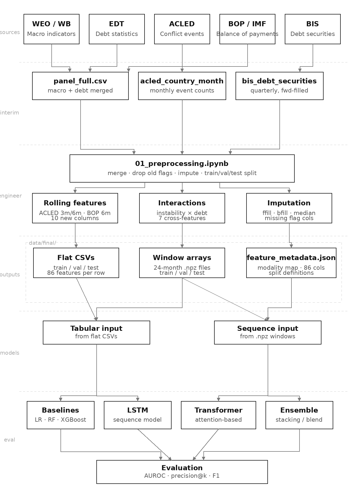
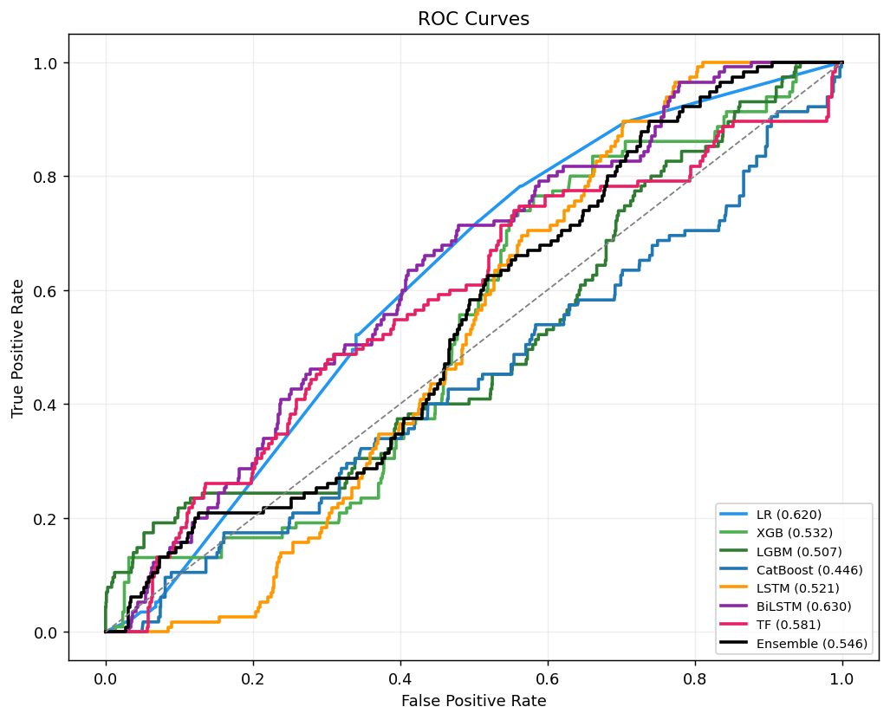
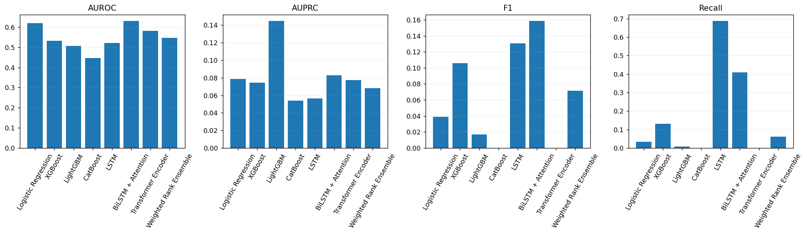
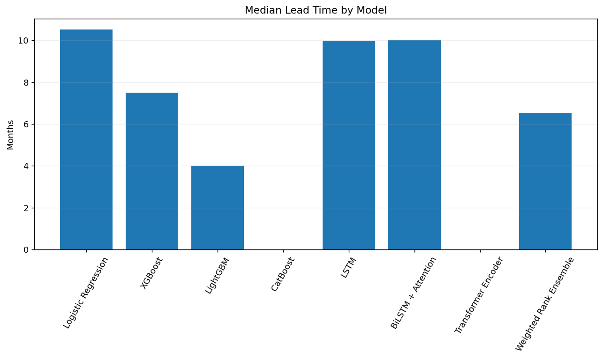

# Early Warning of Sovereign Debt Distress

Predicting sovereign debt distress within 12 months for 32 emerging-market economies using a multimodal Transformer trained on macroeconomic, debt, balance-of-payments, and political-instability signals.

## Problem

Sovereign debt crises rarely come from one variable going wrong. Debt rises while reserves shrink while financing conditions tighten while political instability grows. Most existing early-warning models use a handful of macro indicators and treat each month independently, missing the cross-signal interactions that build up over time.

We frame the task as **binary time-series classification**: given 24 months of economic and political data for a country, predict whether a debt distress event will start in the next 12 months.

- **Panel:** 32 emerging-market economies × 300 months (Jan 2000 – Dec 2024) = 9,600 country-month observations
- **Features:** 86 across 5 modalities (macro, debt & reserves, political, balance of payments, cross-modal interactions)
- **Label:** `distress_within_12m` — 1 if a distress episode begins within the next 12 months. 117 distress events across 24 countries.
- **Class balance:** ~6% positive rate

## Repository structure

```
.
├── README.md
├── requirements.txt
├── notebooks/
│   ├── 01_preprocessing.ipynb     # data/processed/ + data/interim/ -> data/final/
│   └── 02_modeling.ipynb          # trains all models, evaluates, saves results
├── src/
│   └── data_cleaning_pipeline.py  # raw archives -> data/interim/ + data/processed/
├── data/
│   ├── README.md                  # raw-source download links and folder layout
│   ├── raw/                       # untracked; raw archives are downloaded from public sources
│   ├── interim/                   # cleaned single-source CSVs (committed)
│   ├── processed/                 # merged country-month panel (committed)
│   └── final/                     # train/val/test tables, sliding-window arrays, results (committed)
├── docs/
│   ├── data_cleaning_methodology.docx
│   └── modeling_guide.docx
└── figures/
    ├── architecture.png
    ├── roc_curves.png
    ├── model_comparison_bars.png
    └── lead_time_bar.png
```

## Pipeline



Five raw sources (IMF WEO, World Bank IDS, ACLED, IMF BOP, BIS) are cleaned by `src/data_cleaning_pipeline.py` into `data/interim/` and merged into `data/processed/panel_full.csv`. `notebooks/01_preprocessing.ipynb` adds rolling and cross-modal features, splits by time, standardises, and writes flat tables and 24-month sliding windows to `data/final/`. `notebooks/02_modeling.ipynb` trains and evaluates all models on those outputs.

## How to reproduce

```bash
pip install -r requirements.txt
```

**Option A — modeling only (recommended).** The cleaned dataset (~37 MB across `data/interim/`, `data/processed/`, and `data/final/`) is committed in this repo, so cloning is enough. Run `notebooks/02_modeling.ipynb` end to end and set the `BASE` variable at the top of the notebook to the local path of the cloned repository.

A single-archive download (`early-warning-data-v1.0.zip`, ~9 MB) is also attached to the [v1.0 Release](https://github.com/kgoel99/early-warning-of-sovereign-debt-distress/releases/tag/v1.0) for users who prefer to pull just the data without cloning.

**Option B — full pipeline from raw sources.** Follow the download instructions in [`data/README.md`](data/README.md) to populate `data/raw/`, then run:

```bash
python src/data_cleaning_pipeline.py        # raw -> interim -> processed
jupyter nbconvert --execute notebooks/01_preprocessing.ipynb  # processed -> final
jupyter nbconvert --execute notebooks/02_modeling.ipynb       # final -> trained models + metrics
```

## Models

| Family | Models |
|---|---|
| Linear | Logistic regression with elastic-net regularization |
| Tree boosting | XGBoost, LightGBM, CatBoost |
| Recurrent | 2-layer LSTM, 2-layer BiLSTM with attention |
| Self-attention | Transformer encoder (2 layers, 4 heads, attention pooling) — main model |
| Ensemble | Weighted rank ensemble across all of the above |

All neural models share the same training setup: focal loss with γ=2.0 and class weights, AdamW optimizer with ReduceLROnPlateau, early stopping on validation AUPRC, 24-month sliding-window inputs of shape `(B, 24, 86)`. Tabular models use `scale_pos_weight`-style class weighting; logistic regression uses Borderline-SMOTE oversampling as a tested alternative.

## Validation results (2017–2019)

| Model | AUROC | AUPRC | F1 | Precision | Recall |
|---|---:|---:|---:|---:|---:|
| Logistic Regression | 0.694 | 0.188 | 0.198 | 0.458 | 0.126 |
| XGBoost | 0.692 | 0.252 | 0.256 | 0.207 | 0.333 |
| LightGBM | 0.627 | 0.217 | 0.317 | 0.576 | 0.218 |
| CatBoost | 0.704 | 0.238 | 0.376 | 0.397 | 0.356 |
| LSTM | 0.752 | 0.157 | 0.284 | 0.175 | **0.747** |
| BiLSTM + Attention | 0.725 | 0.184 | 0.282 | 0.214 | 0.414 |
| **Transformer Encoder** | **0.754** | **0.249** | **0.382** | 0.374 | 0.391 |
| Weighted Ensemble | 0.741 | 0.191 | 0.338 | 0.388 | 0.299 |

The Transformer encoder is the strongest single model; the LSTM gives the earliest warnings (median ~10 months pre-crisis) at the cost of precision. The test set (2020–2024) is reserved.







## References

- Beers, D., Jones, E., and Walsh, J. (2023). *BoC–BoE Sovereign Default Database: What's New in 2023?* Bank of Canada Staff Analytical Note.
- Vaswani, A., et al. (2017). Attention Is All You Need. *NeurIPS*.
- Hochreiter, S. and Schmidhuber, J. (1997). Long Short-Term Memory. *Neural Computation*.
- Chen, T. and Guestrin, C. (2016). XGBoost: A Scalable Tree Boosting System. *KDD*.
- Ke, G., et al. (2017). LightGBM: A Highly Efficient Gradient Boosting Decision Tree. *NeurIPS*.
- Prokhorenkova, L., et al. (2018). CatBoost: Unbiased Boosting with Categorical Features. *NeurIPS*.
- Lin, T.-Y., et al. (2017). Focal Loss for Dense Object Detection. *ICCV*.
- Han, H., Wang, W.-Y., and Mao, B.-H. (2005). Borderline-SMOTE. *ICIC*.
- Raleigh, C., Linke, A., Hegre, H., and Karlsen, J. (2010). Introducing ACLED. *Journal of Peace Research*.
